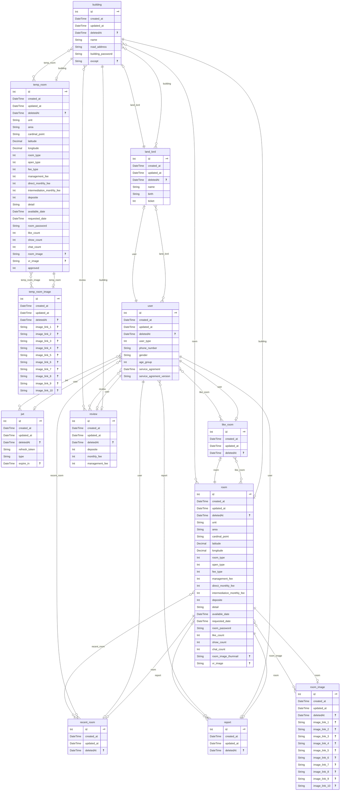

```mermaid
erDiagram

  "building" {
    Int id "🗝️"
    DateTime created_at 
    DateTime updated_at 
    DateTime deletedAt "❓"
    String name 
    String road_address 
    String building_password 
    String except "❓"
    }
  

  "jwt" {
    Int id "🗝️"
    DateTime created_at 
    DateTime updated_at 
    DateTime deletedAt "❓"
    String refresh_token 
    String type 
    DateTime expire_in "❓"
    }
  

  "land_lord" {
    Int id "🗝️"
    DateTime created_at 
    DateTime updated_at 
    DateTime deletedAt "❓"
    String name 
    String birth 
    Int ticket 
    }
  

  "like_room" {
    Int id "🗝️"
    DateTime created_at 
    DateTime updated_at 
    DateTime deletedAt "❓"
    }
  

  "recent_room" {
    Int id "🗝️"
    DateTime created_at 
    DateTime updated_at 
    DateTime deletedAt "❓"
    }
  

  "report" {
    Int id "🗝️"
    DateTime created_at 
    DateTime updated_at 
    DateTime deletedAt "❓"
    }
  

  "review" {
    Int id "🗝️"
    DateTime created_at 
    DateTime updated_at 
    DateTime deletedAt "❓"
    Int deposite 
    Int monthly_fee 
    Int management_fee 
    }
  

  "room" {
    Int id "🗝️"
    DateTime created_at 
    DateTime updated_at 
    DateTime deletedAt "❓"
    String unit 
    String area 
    String cardinal_point 
    Decimal latitude 
    Decimal longitude 
    Int room_type 
    Int open_type 
    Int fee_type 
    Int management_fee 
    Int direct_monthly_fee 
    Int intermediation_monthly_fee 
    Int deposite 
    String detail 
    DateTime available_date 
    DateTime requested_date 
    String room_password 
    Int like_count 
    Int show_count 
    Int chat_count 
    String room_image_thumnail "❓"
    String vr_image "❓"
    }
  

  "room_image" {
    Int id "🗝️"
    DateTime created_at 
    DateTime updated_at 
    DateTime deletedAt "❓"
    String image_link_1 "❓"
    String image_link_2 "❓"
    String image_link_3 "❓"
    String image_link_4 "❓"
    String image_link_5 "❓"
    String image_link_6 "❓"
    String image_link_7 "❓"
    String image_link_8 "❓"
    String image_link_9 "❓"
    String image_link_10 "❓"
    }
  

  "temp_room" {
    Int id "🗝️"
    DateTime created_at 
    DateTime updated_at 
    DateTime deletedAt "❓"
    String unit 
    String area 
    String cardinal_point 
    Decimal latitude 
    Decimal longitude 
    Int room_type 
    Int open_type 
    Int fee_type 
    Int management_fee 
    Int direct_monthly_fee 
    Int intermediation_monthly_fee 
    Int deposite 
    String detail 
    DateTime available_date 
    DateTime requested_date 
    String room_password 
    Int like_count 
    Int show_count 
    Int chat_count 
    String room_image "❓"
    String vr_image "❓"
    Int approved 
    }
  

  "temp_room_image" {
    Int id "🗝️"
    DateTime created_at 
    DateTime updated_at 
    DateTime deletedAt "❓"
    String image_link_1 "❓"
    String image_link_2 "❓"
    String image_link_3 "❓"
    String image_link_4 "❓"
    String image_link_5 "❓"
    String image_link_6 "❓"
    String image_link_7 "❓"
    String image_link_8 "❓"
    String image_link_9 "❓"
    String image_link_10 "❓"
    }
  

  "user" {
    Int id "🗝️"
    DateTime created_at 
    DateTime updated_at 
    DateTime deletedAt "❓"
    Int user_type 
    String phone_number 
    String gender 
    Int age_group 
    DateTime service_agrement 
    String service_agrement_version 
    }
  
    "building" o|--|| "land_lord" : "land_lord"
    "building" o{--}o "review" : "review"
    "building" o{--}o "room" : "room"
    "building" o{--}o "temp_room" : "temp_room"
    "jwt" o|--|| "user" : "user"
    "land_lord" o{--}o "building" : "building"
    "land_lord" o|--|| "user" : "user"
    "like_room" o|--|| "user" : "user"
    "like_room" o|--|| "room" : "room"
    "recent_room" o|--|| "user" : "user"
    "recent_room" o|--|| "room" : "room"
    "report" o|--|| "user" : "user"
    "report" o|--|| "room" : "room"
    "review" o|--|| "user" : "user"
    "review" o|--|| "building" : "building"
    "room" o{--}o "like_room" : "like_room"
    "room" o{--}o "recent_room" : "recent_room"
    "room" o{--}o "report" : "report"
    "room" o|--|| "building" : "building"
    "room" o{--}o "room_image" : "room_image"
    "room_image" o|--|| "room" : "room"
    "temp_room" o|--|| "building" : "building"
    "temp_room" o{--}o "temp_room_image" : "temp_room_image"
    "temp_room_image" o|--|| "temp_room" : "temp_room"
    "user" o{--}o "jwt" : "jwt"
    "user" o{--}o "land_lord" : "land_lord"
    "user" o{--}o "like_room" : "like_room"
    "user" o{--}o "recent_room" : "recent_room"
    "user" o{--}o "report" : "report"
    "user" o{--}o "review" : "review"
```
